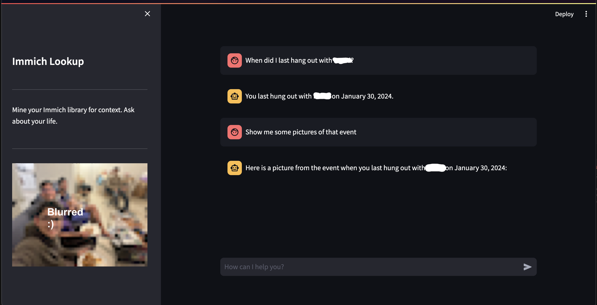

# Immich LifeLens
 Chatbot that uses the [Immich](https://immich.app) API to extract context from your photo library

To run the app, use the command: streamlit run main_streamlit.py

Here are some example prompts:
* Who was at [Person]’s birthday party last year? It happened a few days after his birthday.
* Who did I meet on Jan 26th? Show me the photo.
* When did I last hang out with [Person]? Who else was there?
* Where and when did I last see a cow? Show me the picture.
* When did I last visit Philadelphia?
* When did I first meet [Person]?
* Show me 2 random photos.
* How many photos of [Person] do I have?

These have all worked at some point, but are fairly inconsistant. This can probably be fixed by using a better (gpt-4-turbo) model and better search filtering.

I did this project in 24 hours as part of TartanHacks 2024.

This was inspired by Apple's Journal App as well as Tab's AI companion. People take lots of images every day so a photo library is a powerful tool to extract contextual data about a person's life. Immich has a flexible open source API which makes it easy to pipe this context into a chatbot. This tool is a proof of concept to demonstrate this.

No images are sent to OpenAI, making this a very cost effective and privacy concious app.

Future improvements may include adding a captioning endpoint so you can prompt "Write a journal entry for what I did today" and the bot can use that day's images to do that. Captioning could use the built-in CLIP embeddings or a seperate model.
